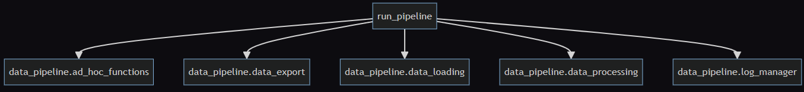
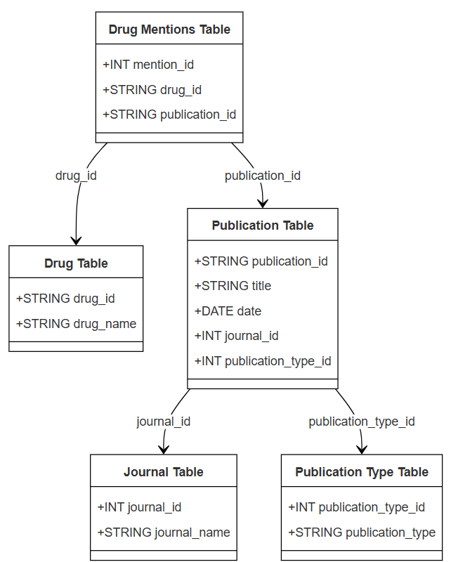
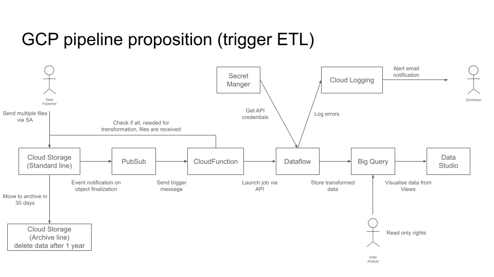
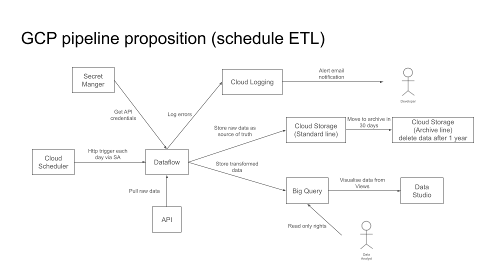

## A - Project : Medicament mention pipeline

### Description

This project is designed to implement a data pipeline to process medicament mentions in various scientific publications. 
The pipeline processes data from several sources, performs data cleansing and transformation, and produces a structured JSON output representing drug mentions across various scientific publications.

### Pipeline Overview
The pipeline performs the following key steps:
1. **Load Data**: Load the data from CSV and JSON formats using pandas.
2. **Drug Mention Detection**: Detect mentions of drugs in the titles of publications (PubMed and clinical trials).
3. **Build Relationship Graph**: Build a graph of drug mentions across journals and publication dates.
4. **Export to JSON**: Export the processed graph into a JSON file.
5. **Ad-hoc Treatment**:
   - Find the name of the journal that mentions the most different drugs.
   - Find all drugs mentioned in the same journals as the target drug in PubMed.

## B - Specifications

[Specification Link](https://drive.google.com/file/d/1Y_7_3hDEfEffOELyaGGMeAeNSy_tNKzd/view?usp=drive_link)

### Dependency Graph  


## C - Prerequisites

The repo is tested in `Python 3.12.1` on Windows 11

## D - Getting Started

Clone project from Github
```
# Clone project from github
git clone https://github.com/mykyrychenko/medicament-mention-pipeline.git
cd medicament-mention-pipeline
```
Set up the environnement
```
# Create the env
python -m venv venv
# Activate env
# On Linux/Mac:
source venv/bin/activate
# On Windows:
./venv/Scripts/activate
```
Install dependencies
```
# Install dependencies from the requirements.txt
pip install -r requirements.txt
```
This project uses Python's built-in unittest framework for testing. 
```
# Run tests
python -m unittest discover
```
Package the run_pipeline.py script into a single executable file
```
pyinstaller --onefile run_pipeline.py
```
Locate the Executable
```
./dist/run_pipeline
```

## E - Usage

Note that you can have access to compiled versions : 
[Link](https://github.com/mykyrychenko/medicament-mention-pipeline/releases)

### 1/ Run pipeline from code

Once the environment is set up
Run the pipeline as below
```
# Start pipeline
cd ./medicament-mention-pipeline
python ./run_pipeline.py
```

### 2/ Run Server from compiled version
on Windows (binaries [Link](https://github.com/mykyrychenko/medicament-mention-pipeline/releases)
) :
Run run_pipeline.exe from ./medicament-mention-pipeline

## F - Output
Pipeline generates an output json file ./output_data/drug_mentions.json.  
Ad-hoc treatment functions output their results to the console:
   - Print the name of the journal that mentions the most different drugs
   - Print all drugs mentioned in the same journals as the target drug in PubMed

## G - Improvements

### 1/  
To treat the big data objects (terabytes) we can read and process the data in chunks (using pandas).  
Load data into a BigQuery database. Run queries to retrieve the necessary information efficiently.   

### 2/
To deal with millions of files : 
   - load files in time-based batches (trigger Dataflow job by Cloud Scheduler each day). 
   - load files by file count batches (trigger Cloud Function to count the number of files in Cloud Storage by Cloud Scheduler each minute. Trigger Dataflow if number of files in input path is bigger than 1000).

## H - DB proposition


## I - Pipeline propositions
### Pipeline proposition 1  


### Pipeline proposition 2  


## H - SQL exercies 
### Part 1
```
SELECT 
    date AS date,
    SUM(prod_price * prod_qty) AS ventes
FROM 
    TRANSACTIONS
WHERE 
    date BETWEEN '2019-01-01' AND '2019-12-31'
GROUP BY 
    date
ORDER BY 
    date;
```

### Part 2
```
SELECT 
    t.client_id AS client_id,
    SUM(CASE WHEN p.product_type = 'MEUBLE' THEN t.prod_price * t.prod_qty ELSE 0 END) AS ventes_meuble,
    SUM(CASE WHEN p.product_type = 'DECO' THEN t.prod_price * t.prod_qty ELSE 0 END) AS ventes_deco
FROM 
    TRANSACTIONS t
JOIN 
    PRODUCT_NOMENCLATURE p ON t.prod_id = p.product_id
WHERE 
    t.date BETWEEN '2019-01-01' AND '2019-12-31'
GROUP BY 
    t.client_id;
```
